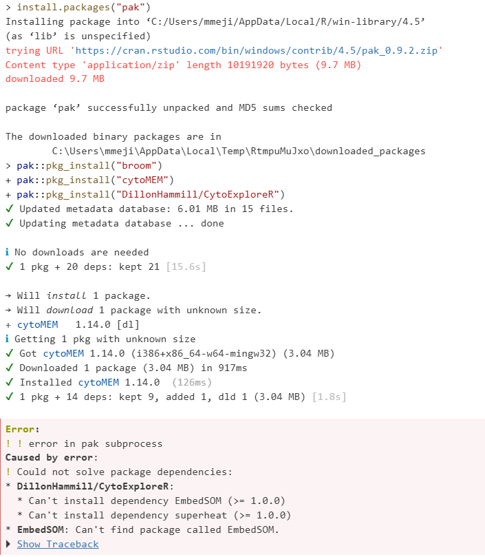
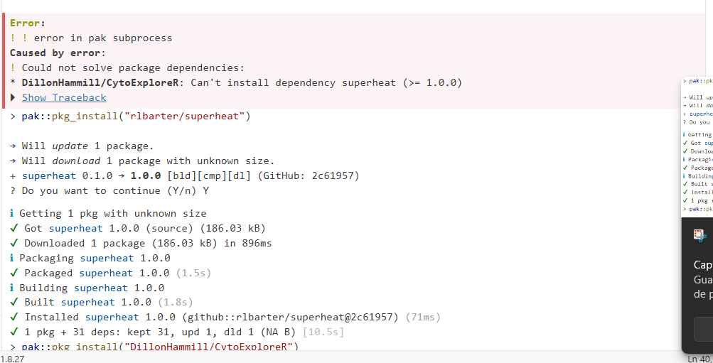

### Problem 1

*We installed PeacoQC during this session, but we didn’t have time to explore what functions are present within the package. Using what you have learned about accessing documentation, figure out and list what functions it contains*

```{r}
library("PeacoQC")
ls("package:PeacoQC")
```

### Problem 2

*Take a closer look at the list of Bioconductor cytometry packages. Report back on how many there are currently in Bioconductor, the author/maintainer with the most contributed cytometry R packages, and a couple packages that you would be interested in exploring more in-depth later in the course.*

There are 69 packages, Mike Jiang is the author that contributed the most and could be interesting to work with CytoPipelineGUI

### Problem 3

*There is another way to install R packages, using the newer pak package. Positron uses this when installing suggested dependencies.* *After learning more about it via the documentation and it’s pkgdown website, I would like you to attempt to install the following three R packages using this newer method: “broom”, “cytoMEM”, “DillonHammill/CytoExploreR”.* *Take screenshots, and in a new quarto markdown document, describe how the installation process differed from what you saw for install.packages(), install() and install_github().*

```{r}
pak::pkg_install("broom")
pak::pkg_install("cytoMEM")
pak::pkg_install("rlbarter/superheat")
pak::pkg_install("DillonHammill/CytoExploreR")

```

The package syntax is more consistent to use compared to use differente packages depending on the source. I found some issues when there is a missing package from Github. In this case the user needs to find the package and include a new line to install it.

 